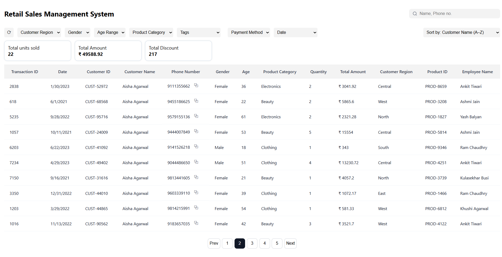

# Retail Sales Management System

This repository contains a full-stack Retail Sales Management System built as the TruEstate SDE intern assignment. It provides a dashboard for searching, filtering, sorting, and paginating retail transaction data. The architecture is modular and designed so backend filtering/search/sorting scales to larger data sources (CSV).

## Tech Stack

- **Frontend**: React, Vite, JavaScript, HTML, CSS
- **Backend**: Node.js, Express
- **HTTP Client**: Axios (or Fetch API)
- **Config**: dotenv
- **Data**: CSV (DB-ready service layer)

## Search

- **Scope**: Full-text search on Customer Name and Phone Number
- **Behavior**: Case-insensitive, trimmed, and normalized
- **Integration**: Works together with active filters, sorting, and pagination
- **Location**: Implemented in the backend service layer for consistency and performance

## Filters

- **Supported filters**: Customer Region, Gender, Age Range, Product Category, Tags, Payment Method, Date Range
- **Behavior**: Filters can be used independently or combined and are preserved across sorting and pagination
- **Metadata**: Filter options are dynamically populated via backend metadata endpoints

## Sorting

- **Fields**: Date (newest first), Quantity, Customer Name (A–Z)
- **Behavior**: Sorting preserves active search and filters and is applied in the backend using stable sorting logic

## Pagination

- **Page size**: 10 records per page
- **Controls**: Next / Previous navigation
- **Behavior**: Backend-driven page calculation; API responses include `totalPages` and `currentPage`

## Quick Setup

Clone the repository and install both backend and frontend dependencies, then start each server.

```cmd
git clone https://github.com/rajeevsingh3108/Retail-Sales-Management-System.git
cd Retail-Sales-Management-System
```

Backend

```cmd
cd backend
npm install
npm start
# Backend default: http://localhost:5000
```

Frontend

```cmd
cd frontend
npm install
npm run dev
# Frontend default: http://localhost:5173
```

## Screenshot

If you have a dashboard screenshot, save it as `docs/dashboard-screenshot.png` and it will render here:



## 👨‍💻 Developer

- **Rajeev Singh**  
  📧 [singhrajeev2531@gmail.com]  
  🌐 [LinkedIn](https://www.linkedin.com/in/rajeevsingh3108/) · [GitHub](https://github.com/rajeevsingh3108)